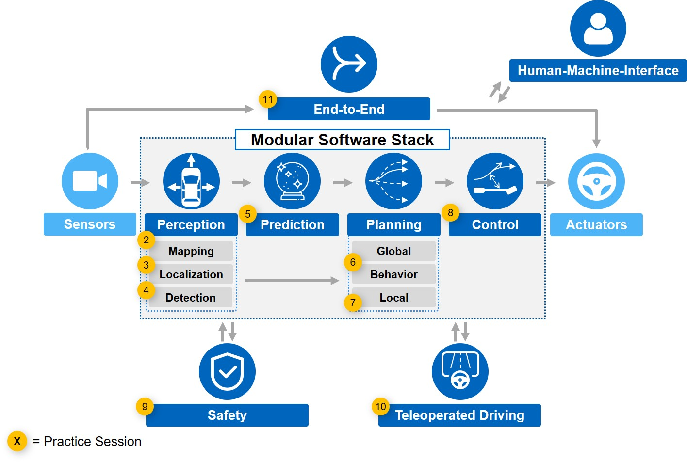

# Lecture: Autonomous Driving Software Engineering
This is the official repository of the lecture "Autonomous Driving Software Engineering" by the Institute of Automotive Technology (Prof. Dr.-Ing. Lienkamp), TUM. You find the code from all the practice sessions in the related subdirectories. The following figure outlines the structure of the repository, which is based on the lecture's chapters:

 

The practice sessions are presented in jupyter notebooks (`practice.ipynb`). Note that there are recordings of each session on our YouTube-channel, link below. Comprehensive explanations of the code are given in these videos. Some useful links:

All recordings can be found on our [YouTube-Channel](https://youtube.com/playlist?list=PLRk3Kku2FrqJiIV1thvn_L5CEQrrbpvgv).  

The associated lecture slides are accessible on [ResearchGate](https://www.researchgate.net/project/Lecture-Autonomous-Driving-Software-Engineering). 

To get more information about our institute, visit our [homepage](https://www.mw.tum.de/en/ftm/home/).

# Requirements
- Python 3.8
- Anaconda Navigator 2.0.3 ([Download](https://www.anaconda.com/products/individual), [Documentation](https://docs.anaconda.com/anaconda/user-guide/getting-started/))
- Windows, MacOS and Linux are supported 
# Setup
1. First setup the anaconda environment by importing `ADSE_conda_environment.yml` into the anaconda navigator.
2. Launch jupyter notebook via the anaconda navigator. Note to activate the installed environment.
3. You can run all practice notebooks with the provided anaconda environment except the practice sessions 3, 6, and 11. These practice sessions have other dependencies, please check out the local readmes in the related sub-directories. Practice 3 runs in ROS, so Linux is recommended.

# How to get started
The procedure of the lecture is as follows:
1. Watch the video of a single lecture in the [YouTube-Playlist](https://youtube.com/playlist?list=PLRk3Kku2FrqJiIV1thvn_L5CEQrrbpvgv) and go through the slides in the [ResearchGate-Project](https://www.researchgate.net/project/Lecture-Autonomous-Driving-Software-Engineering).
2. Watch the video of the associated practice session in the [YouTube-Playlist](https://youtube.com/playlist?list=PLRk3Kku2FrqJiIV1thvn_L5CEQrrbpvgv) and test the related practice code in this repository on your own.
3. Go to the next chapter and repeat step 1 and step 2.
# Content
|Number| Session       | Description   | Video | Lecture Slides|
|:----:| ------------- |:-------------| :-----:|:-----:|
|  1   | Python intro                       | Some basics of programming in python for beginners.                                                                                                                                                    | ---                                     | [ResearchGate](https://www.researchgate.net/publication/352321561_Autonomous_Driving_Software_Engineering_-_Lecture_01_Introduction_to_Autonomous_Driving)    |
|  2   | Basics of mapping and localization | Exemplary implementation of a Kalman filter and application for localization via GNSS-signal.                                                                                                          | [YouTube](https://youtu.be/JW8z7tn8WH8) | [ResearchGate](https://www.researchgate.net/publication/352321825_Autonomous_Driving_Software_Engineering_-_Lecture_02_Perception_I_-_Basics_of_Mapping_and_Localization)    |
|  3   | SLAM                               | The google cartographer SLAM algorithm is applied to data from the KITTI-dataset. Note, that this lecture is held in Linux and has its own dependencies, please refer to the local readme.             | [YouTube](https://youtu.be/IMSpasiy8Lk) | [ResearchGate](https://www.researchgate.net/publication/352321792_Autonomous_Driving_Software_Engineering_-_Lecture_03_Perception_II_-_SLAM)    |
|  4   | Detection                          | Overview about the YOLO-approach from network  architecture to exemplary usage.                                                                                                                        | [YouTube](https://youtu.be/THyozTdumMc) | [ResearchGate](https://www.researchgate.net/publication/352322076_Autonomous_Driving_Software_Engineering_-_Lecture_04_Perception_III_-_Detection)    |
|  5   | Prediction                         | Implementation of the pipeline to setup a motion prediction algorithm based on a Encoder-Decoder architecture.                                                                                     | [YouTube](https://youtu.be/8ja6IRxHa_U) | [ResearchGate](https://www.researchgate.net/publication/352321496_Autonomous_Driving_Software_Engineering_-_Lecture_05_Prediction)    |
|  6   | Global plannings                   | A global optimal race line optimization is shown. This lecture has its own dependencies, please refer to the local readme.                                                                         | [YouTube](https://youtu.be/1MD_IqJIaz4) | [ResearchGate](https://www.researchgate.net/publication/352350798_Autonomous_Driving_Software_Engineering_-_Lecture_06_Planning_I_-_Global_Planning)    |
|  7   | Local planning                     | A local planning algorithm based on a graph-based approach is presented.                                                                                                                               | [YouTube](https://youtu.be/OB-JaJ5KROQ) | [ResearchGate](https://www.researchgate.net/publication/352322244_Autonomous_Driving_Software_Engineering_-_Lecture_07_Planning_II_-_Local_Planning)    |
|  8   | Control                            | The design of a velocity controller and numerical solver for differential equation are covered.                                                                                                        | [YouTube](https://youtu.be/WJ-mR0OGgzg) | [ResearchGate](https://www.researchgate.net/publication/352322266_Autonomous_Driving_Software_Engineering_-_Lecture_08_Control)    |
|  9   | Safety assessment                  | The evaluation of the criticality of planned trajectories based on various metrics and their sensitivity is discussed.                                                                             | [YouTube](https://youtu.be/axC4tI5OL3M) | [ResearchGate](https://www.researchgate.net/publication/352322387_Autonomous_Driving_Software_Engineering_-_Lecture_09_Safety_Assessment)    |
|  10  | Teleoperated driving               | How to send and receive data via MQTT over network is shown in this practice session.                                                                                                                  | [YouTube](https://youtu.be/Z95BMnuFSio) | [ResearchGate](https://www.researchgate.net/publication/352322590_Autonomous_Driving_Software_Engineering_-_Lecture_10_Teleoperated_Driving)    |
|  11  | End-to-End                         | The exemplary pipeline of data collection from expert demonstration, training and application are treated in this session. This lecture has its own dependencies, please refer to the local        | [YouTube](https://youtu.be/CobI-h1wRAs) | [ResearchGate](https://www.researchgate.net/publication/352322925_Autonomous_Driving_Software_Engineering_-_Lecture_11_End-to-End_Combined_Modules)    |

# Contributions
If you find our work useful in your research, please consider citing the associated lecture at our [ResearchGate-Project](
https://www.researchgate.net/project/Lecture-Autonomous-Driving-Software-Engineering).
